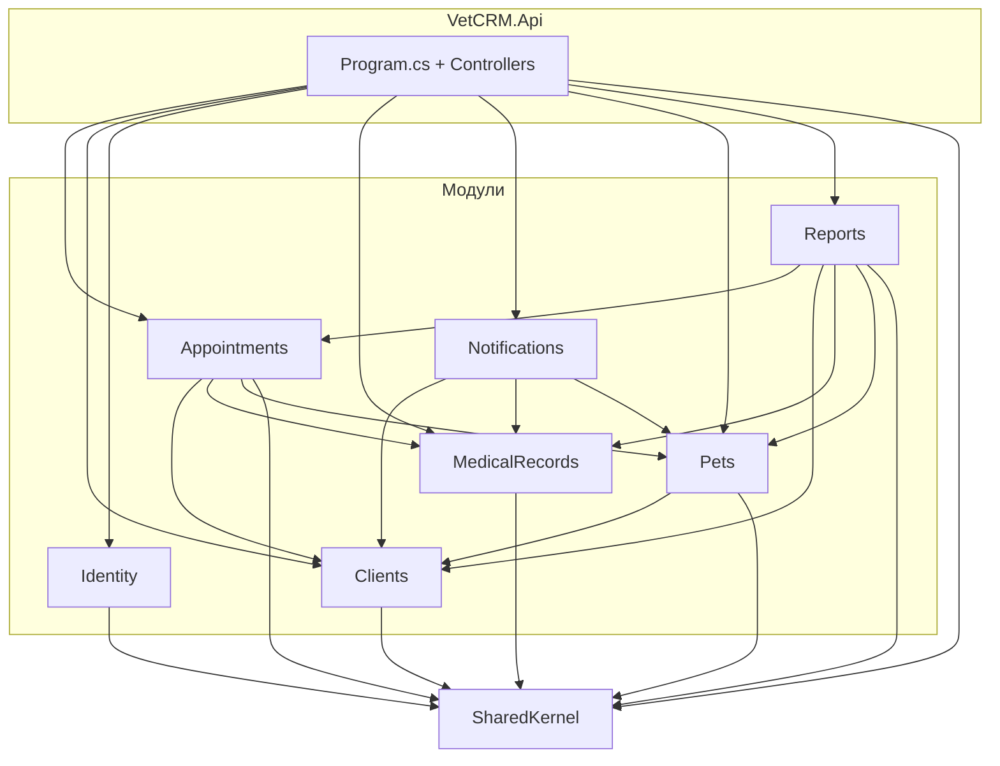

# Зависимости проектов и соответствие архитектуре

## Диаграмма зависимостей (project references)

## Как модули используют друг друга (только контракты)

Перекрёстные ссылки между модулями идут **только на слой Application.Contracts**:

| Модуль-потребитель | Зависит от модуля | Что использует |
|--------------------|-------------------|----------------|
| Pets | Clients | `IClientReadService` |
| Appointments | Clients | `IClientReadService` |
| Appointments | Pets | `IPetReadService` |
| Appointments | MedicalRecords | `ICreateMedicalRecordFromAppointment` |
| Notifications | Clients | `IClientReadService` |
| Notifications | Pets | `IPetReadService` |
| Notifications | MedicalRecords | `IUpcomingVaccinationsQuery` |
| Reports | Appointments | `IAppointmentsForReportQuery` |
| Reports | Clients | `IClientReadService` |
| Reports | MedicalRecords | `IUpcomingVaccinationsQuery` |
| Reports | Pets | `IPetReadService` |

Ни один модуль не ссылается на **Infrastructure** или **Domain** другого модуля — только на контракты (интерфейсы и DTO в Application.Contracts).

---

## Проверка принципов

### 1. Каждый модуль = отдельный проект

**Соблюдено.** Модули — отдельные .csproj: Appointments, Clients, Identity, MedicalRecords, Notifications, Pets, Reports. SharedKernel — общий проект, не модуль.

### 2. Api знает модули только через Module.cs

**Соблюдено.** В Api:

- Есть ссылки на проекты модулей (без этого нельзя вызвать `AddXxxModule` и использовать handlers в контроллерах).
- Подключение модулей выполняется **только** через extension-методы в `Module.cs` каждого модуля (`AddAppointmentsModule`, `AddClientModule`, `AddIdentityModule`, …) в `Program.cs`.
- Контроллеры зависят от handlers и DTO, зарегистрированных в DI именно в `Module.cs`; прямого использования Infrastructure модулей в Api нет.

То есть точка входа в модуль для Api — это его `Module.cs`.

### 3. Модули не зависят друг от друга напрямую

**Толкование «нет project reference между модулями»** — не соблюдено: у Pets, Appointments, Notifications, Reports есть прямые ссылки на другие модули.

**Толкование «зависимость только по контрактам (общение только через контракты)»** — соблюдено:

- Модули ссылаются друг на друга только как на проекты, в коде используются только типы из **Application.Contracts** других модулей (интерфейсы, DTO).
- Нет обращений к Domain или Infrastructure другого модуля.

В документации задано правило: «общение между модулями — только через контракты (interfaces)». Текущая структура ему соответствует: прямые ссылки между проектами есть, но пересечение модулей — только по контрактам.

---

## Итог

| Принцип | Статус |
|--------|--------|
| Каждый модуль = отдельный проект | Соблюдено |
| Api знает модули только через Module.cs | Соблюдено |
| Модули не зависят друг от друга «напрямую» в смысле использования только контрактов | Соблюдено |

Архитектура не нарушена: межмодульное взаимодействие идёт только через контракты (Application.Contracts).
