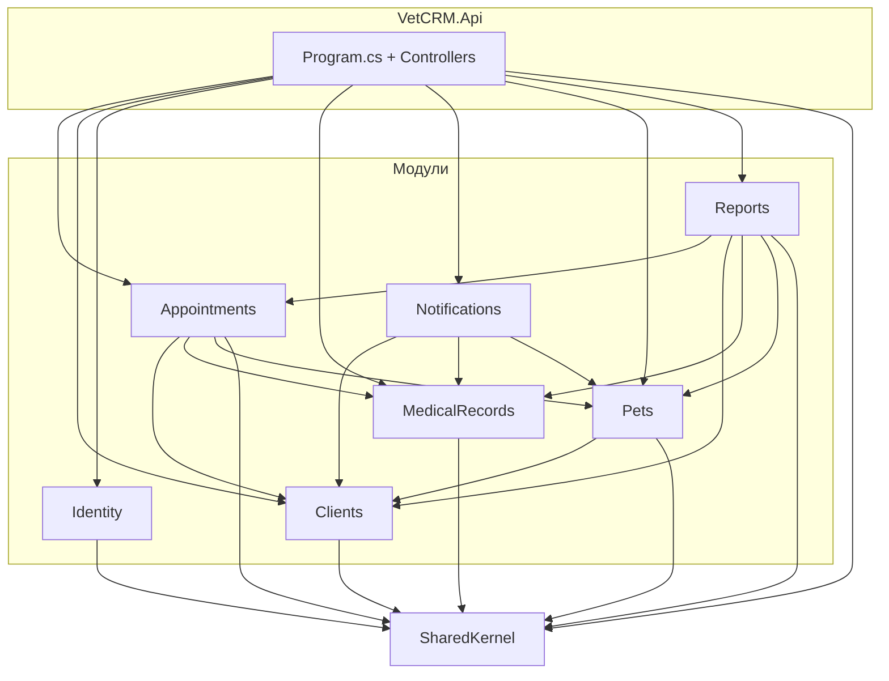

# Схема модулей VetCRM

Структура модулей и зависимости между ними (точка входа — Api, межмодульное общение только через контракты Application).

Подробнее о контрактах и принципах — [architecture-dependencies.md](architecture-dependencies.md).
